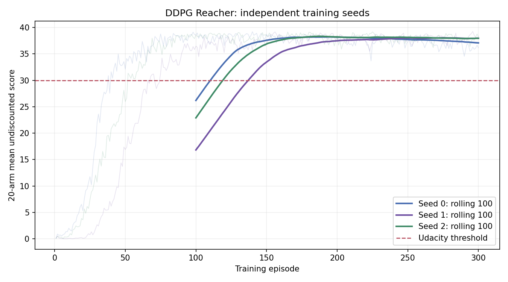

# Continuous Control — DDPG Portfolio

Udacity Reacher (20 agents). This DDPG baseline met the course's +30 rolling 100-episode training criterion in three independent runs. The first qualifying window ended at episodes **111, 138, and 120**. Separately evaluated deterministic policies scored **37.838 ± 0.713** across training seeds (mean ± population SD of three run means; not a confidence interval or significance claim).



See [Report.md](Report.md) for the per-seed results, metric definitions, method, and limitations. Raw logs, saved weights, plots, and evaluation JSON are in `artifacts/`. A [24-second rendered Unity demo excerpt](artifacts/reacher_ddpg_demo.mov) shows the trained policy controlling the 20 Reacher arms.

## Verified environment

On 2026-10-01, the official Mac build ran with ARM Python 3.9.6 on macOS 26.6.2. The executable is x86_64 (Rosetta available), Unity 2017.3.1f1 (fc1d3344e6ea). Each of 20 agents receives 33 observations and accepts 4 continuous actions in [-1,1]. Agents share one learner; they are not independent training seeds.

## Setup (tested Mac configuration)

```sh
python3 -m venv .venv
.venv/bin/python -m pip install --upgrade pip 'setuptools>=68'
mkdir -p environments
curl -fL https://s3-us-west-1.amazonaws.com/udacity-drlnd/P2/Reacher/Reacher.app.zip -o environments/Reacher.app.zip
unzip -q environments/Reacher.app.zip -d environments
# Obtain the original legacy API, not the current ml-agents package.
git clone https://github.com/udacity/deep-reinforcement-learning.git environments/udacity
git -C environments/udacity checkout 561eec3ae8678a23a4557f1a15414a9b076fdfff
.venv/bin/python -m pip install -e '.[dev]'
.venv/bin/python -m pip install --no-deps --no-build-isolation ./environments/udacity/python
```

The local verification used a clean copy of that commit's `python/` directory at `environments/legacy-python`. Legacy package dependencies are deliberately installed separately: this bridge needs numpy, grpcio, protobuf and Pillow, not the old TensorFlow training stack. A narrowly scoped compatibility alias in the adapter restores `np.float_` for unityagents 0.4.0 with NumPy 2. PyTorch 2.8.0 is installed for the networks. The legacy package metadata requests obsolete training dependencies; pip may report conflicts. This is a tested bridge configuration, not full compatibility with the legacy training stack.

Archive SHA256: `0ebc254eab2eefa250e0a761496038737ac7ee5deedf25ba0434e710c1cd1b97`.

## Verify

```sh
.venv/bin/python -m pytest -q
.venv/bin/reacher-smoke --environment environments/Reacher.app --steps 50
.venv/bin/reacher-smoke --environment environments/Reacher.app --steps 1100 --output artifacts/smoke-boundary.json
```

Unity and Python require a local communication port (default here 5026). A restricted sandbox can block binding; that failure does not prove a worker is already running, despite the legacy error message. Use `--worker-id` if a real port conflict occurs. Add `--render` to show the environment.

`artifacts/smoke.json` records the actual reset/step/reset/close check, runtime versions, shapes and executable hash. Random-action reward sums are partial diagnostic totals, not training or evaluation scores. Ten adapter tests cover all-agent preservation, action validation, lifecycle, transition alignment and brain contract checks.

## Code and next steps

- `src/continuous_control/environment.py`: all-agent legacy bridge; validates shapes, bounds, IDs and finite outputs.
- `src/continuous_control/smoke.py`: real environment probe with JSON evidence.
- `tests/test_environment.py`: injected fake environment for adapter invariants.
- `src/continuous_control/networks.py`: Actor 33→256→256→4 (Tanh); Critic 37→256→256→1 (linear output). Hidden activations are ReLU. Output weights start uniform in [-0.003,0.003], output biases at zero; hidden initialization uses PyTorch defaults. Seed torch before construction. No exploration or optimization occurs in forward.
- `tests/test_networks.py`: batch interfaces, action bounds, unrestricted Q output, independent parameters, seed reproducibility and Actor gradients through a frozen Critic.
- `src/continuous_control/replay.py`: seeded ring buffer. `add` receives all N arms and actual clipped actions; `sample(B)` draws distinct aligned transitions into float32 arrays `[B,33]`, `[B,4]`, `[B,1]`, `[B,33]` and bool `[B,1]`. Capacity defaults to 1,000,000 transitions and storage is allocated on first add. The raw legacy done signal is preserved without assigning terminal semantics.
- `tests/test_replay.py`: checks 20-arm collection, sample alignment, overwrite, copy isolation, seeded sampling and invalid input.
- `src/continuous_control/targets.py`: deep-copy online Actor/Critic into initially identical, frozen target networks; soft update every parameter with `target = (1-tau)*target + tau*online`. Rejects invalid tau and mismatched structures. The helper intentionally rejects parameter buffers because the current networks have none.
- `tests/test_targets.py`: checks independent initialization, frozen parameters, the numeric 2→2.8 soft update, online immutability and invalid inputs.
- `src/continuous_control/agent.py`: seeded Gaussian exploration, Bellman target, Critic MSE, Actor negative-Q loss, and target soft updates. The Critic is frozen only during the Actor update, while its action gradient remains available.
- `src/continuous_control/cli.py`: `train`, `evaluate`, `plot`, checkpoint, JSONL logs, summary, and learning curve.

Legacy `local_done` does not distinguish termination from truncation. Replay retains it raw; the collector's explicit fixed-horizon assumption is documented below. Any agent ending currently requires a full reset, appropriate for the observed synchronous task; asynchronous endings would need a different collector.

## Train and evaluate

```sh
.venv/bin/reacher-control train --environment environments/Reacher.app --output artifacts/baseline-seed0 --seed 0 --worker-id 40 --episodes 300
.venv/bin/reacher-control evaluate --environment environments/Reacher.app --checkpoint artifacts/baseline-seed0/best_rolling_100.pt --output artifacts/baseline-seed0/evaluation.json --seed 10000 --worker-id 41 --episodes 10
```

`train` uses one shared policy for all 20 arms. Defaults: 1001 environment steps per full episode, 1000 random-action warmup steps, batch 128, replay capacity 1,000,000 transitions, one gradient update per environment step after warmup, Gaussian action noise standard deviation 0.2, discount 0.99, soft-update rate 0.001, Actor/Critic learning rates 0.0001/0.001. These are baseline choices, not tuned results. `best_rolling_100.pt` exists only after 100 complete episodes. `last.pt` is saved at the requested interval and at normal completion. The checkpoint stores optimizer and RNG state, but replay is not serialized, so the CLI does not claim exact training resume.

After separate training and evaluation runs for multiple seeds, `reacher-results --run artifacts/baseline-seed0 --run artifacts/baseline-seed1 --run artifacts/baseline-seed2 --output artifacts/aggregate.json --plot artifacts/learning_curves_comparison.png` checks that configurations match, keeps unsolved/missing-evaluation runs visible, and computes population SD across independent run means. It does not turn 20 arms or multiple episodes from one run into independent training seeds.

Each `episodes.jsonl` row distinguishes full episodes from truncated diagnostic runs and includes each arm score, their mean, rolling 100 mean only when the last 100 episodes are complete, environment steps, transitions, optimizer updates and observed elapsed time. `summary.json` records the first qualifying 100-episode window's start and end if reached; `training_curve.png` plots real logged values. Evaluation reloads a checkpoint, disables exploration and optimizer updates, and writes separate per-episode and per-arm scores plus across-episode population SD. That SD is not across independently trained seeds.

Evaluation runs Unity in fast simulation mode by default (`train_mode=True` in the legacy API). This flag controls simulation speed; the CLI separately disables action noise and optimizer updates. Pass `--realtime` for display-speed simulation.

For a rendered deterministic rollout, use `.venv/bin/reacher-control demo --environment environments/Reacher.app --checkpoint artifacts/baseline-seed0/best_rolling_100.pt --output artifacts/demo_rollout.json --seed 20000 --worker-id 60`. A complete real Unity rollout was verified with mean score 39.0045 on that seed; `demo_rollout.json` records it separately from the formal evaluation. The manually recorded [demo video](artifacts/reacher_ddpg_demo.mov) is a 24-second excerpt of the rendered rollout, not a recording of all 1001 environment steps.

The original Unity API reports only `local_done`. Our observed build emitted 20 simultaneous flags on step 1001. This baseline treats that specific fixed horizon as time-limit truncation and bootstraps from the pre-reset next observation. It stops with an error for earlier/asynchronous done events, because those would require a separate termination rule. This is an explicit assumption based on observed behavior, not an environment-provided termination label.

### End-to-end diagnostic evidence

`artifacts/diagnostic-seed0/` contains one complete training episode (1001 environment steps, 20,020 transitions, two optimizer updates after warmup), a loadable checkpoint, and one separate deterministic evaluation episode. Training mean was 0.0795; independent evaluation mean was 0.0. These numbers only confirm that the pipeline runs; they do not estimate a trained policy's quality or meet the +30 threshold.

`artifacts/diagnostic-seed1/` contains a two-episode integration run: 40,040 transitions and 1,003 updates. It checks sustained learning and checkpoint writing, not a solved policy.

## Scoring plan

For each training episode, sum undiscounted rewards per arm, then average the 20 arms. The course threshold is a mean >=30 across 100 complete consecutive episode averages. The three observed first qualifying windows ended at 111, 138, and 120. Independent frozen-policy evaluation, best episode, and variation across independently trained seeds are reported separately in `Report.md`.

[Official project](https://github.com/udacity/deep-reinforcement-learning/tree/master/p2_continuous-control)
